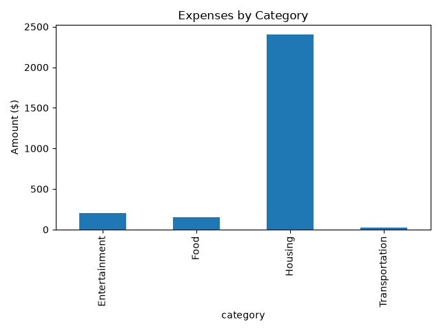

# Financial Expense Analyzer

## Screenshot



A beginner-friendly Data Engineering project built with Python and Pandas.

## Project Objective

Analyze personal financial expenses and generate useful insights, including:

- Total expenses
- Average expense
- Expenses by category
- Highest spending category
- Bar chart visualization

## Technologies

- Python
- Pandas
- Matplotlib

## Project Structure

```
financial-expense-analyzer
│
├── data
│   └── expenses.csv
│
├── src
│   └── main.py
│
├── README.md
└── requirements.txt
```

## How to Run

```bash
pip install -r requirements.txt
cd src
python main.py
```

## Features

- Load expense data from CSV
- Analyze expenses using Pandas
- Display financial statistics
- Generate a bar chart
